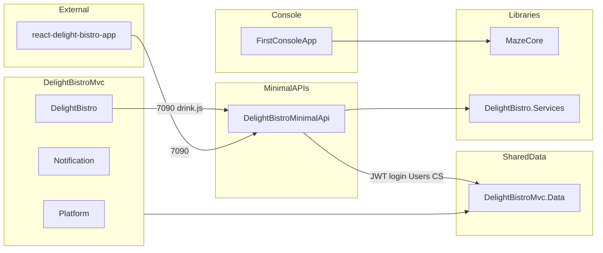

# Карта интеграций DelightBistro

Связи между DelightBistroMvc (MVC), Minimal API, React-витриной и общими библиотеками.

## Архитектурный паттерн

- **DelightBistroMvc** использует `WebContext` ([DelightBistroMvc.Data](libraries/delight-bistro-mvc-data/README.md)) — БД `WebNet23Online` (LocalDB). Пароли — `UserData.PasswordHash` (BCrypt). Вход на сайте — **cookie** ([Auth](delight-bistro-mvc/modules/platform/auth.md)).
- **Minimal API** для каталога напитков использует **отдельный** `MiniDbContext` и БД `WebNet23Tea` (`ConnectionStrings:Drinks`). Для **JWT login** API дополнительно регистрирует `WebContext` на `ConnectionStrings:Users` (та же `WebNet23Online`) и ProjectReference на DelightBistroMvc.Data — без дублирования пользователей.
- Аутентификация API — **JWT Bearer** (`POST /login`, `DELETE /DeleteDrink/{id}` — роль Admin). DTO/валидация на границе HTTP. Подробно: [jwt-auth.md](minimal-apis/delight-bistro/jwt-auth.md), [README Minimal API](minimal-apis/delight-bistro/README.md).
- Модуль DelightBistro вызывает Minimal API из JavaScript (`wwwroot/js/delight-bistro/drink.js`) по HTTPS. Сервер MVC API через HttpClient не вызывает.
- Отдельная витрина [react-delight-bistro-app](../../react-delight-bistro-app/) (вне `.sln`) ходит в тот же API (`https://localhost:7090`).
- Кэш каталога напитков — `IDrinksCacheService` (Memory или Redis по `Caching:Provider`) плюс OutputCache; логирование API — [DelightBistro.Services](libraries/delight-bistro-services/README.md) (`ConnectionStrings:Logging`).
- У DelightBistroMvc есть ProjectReference на DelightBistroMinimalApi (сборка в одном решении); runtime-вызовы идут из браузера.

---

## MVC → Minimal API

| MVC-модуль | JS-файл | API | Порт | Назначение |
|------------|---------|-----|------|------------|
| DelightBistro | `wwwroot/js/delight-bistro/drink.js` | DelightBistroMinimalApi | 7090 | Каталог напитков (`GetDrinks` / `CreateDrink`) |

---

## React → Minimal API

| Клиент | Файл | API | Назначение |
|--------|------|-----|------------|
| react-delight-bistro-app | `src/services/drinks-service.ts` | DelightBistroMinimalApi :7090 | Список / карточка / CRUD напитков |

---

## MVC → DelightBistroMvc.Data

Бизнес-данные DelightBistroMvc работают через `WebContext`:

- Platform (пользователи, профили)
- Notification (отложенные уведомления)
- DelightBistro (меню, блюда, ингредиенты, заказы)

→ [libraries/delight-bistro-mvc-data/README.md](libraries/delight-bistro-mvc-data/README.md)

---

## Libraries → Projects

| Библиотека | Используют |
|------------|------------|
| DelightBistroMvc.Data | DelightBistroMvc; DelightBistroMinimalApi (JWT login / `WebContext` на `Users`) |
| MazeCore | FirstConsoleApp |
| DelightBistro.Services | DelightBistroMinimalApi |

---

## SignalR (внутри DelightBistroMvc)

Real-time функции реализованы внутри MVC, не через Minimal API.

| Hub | Маршрут | Назначение |
|-----|---------|------------|
| `DeligtBistroHub` | `/my-hub/delightbistro` | Legacy-чат + тост «новое блюдо» |
| `NewChatHub` | `/my-hub/new-chat` | Новый чат с историей в БД (`ChatMessageData`) |
| `NotificationHub` | `/my-hub/notification` | Site-wide уведомления |

→ [delight-bistro-mvc/appendix/signalr-hubs.md](delight-bistro-mvc/appendix/signalr-hubs.md)  
→ Модуль: [modules/delight-bistro/README.md](delight-bistro-mvc/modules/delight-bistro/README.md)

---

## Диаграмма

