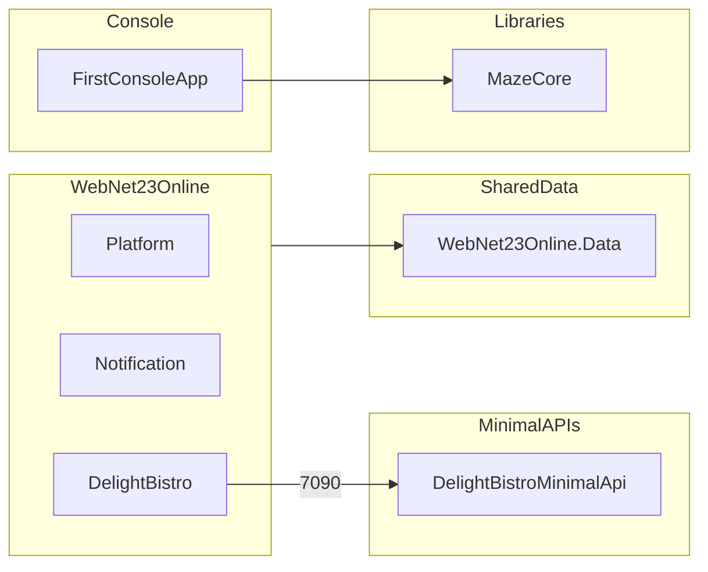

# Карта интеграций Net23Online

Связи между WebNet23Online (MVC), Minimal API и общими библиотеками.

## Архитектурный паттерн

- **WebNet23Online** использует `WebContext` ([WebNet23Online.Data](../WebNet23Online.Data/)) — основная БД сайта.
- **Minimal API** используют **отдельные DbContext и БД** (LocalDB), не `WebContext`.
- Модуль DelightBistro вызывает Minimal API из JavaScript (`wwwroot/js/delight-bistro/tea.js`) по HTTPS.

---

## MVC → Minimal API

| MVC-модуль | JS-файл | API | Порт | Назначение |
|------------|---------|-----|------|------------|
| DelightBistro | `wwwroot/js/delight-bistro/tea.js` | DelightBistroMinimalApi | 7090 | Каталог чая/напитков |

---

## MVC → WebNet23Online.Data

Бизнес-данные WebNet23Online работают через `WebContext`:

- Platform (пользователи, профили)
- Notification (отложенные уведомления)
- DelightBistro (меню, блюда, ингредиенты, заказы)

→ [libraries/web-net23-online-data/README.md](libraries/web-net23-online-data/README.md)

---

## Libraries → Projects

| Библиотека | Используют |
|------------|------------|
| WebNet23Online.Data | WebNet23Online |
| MazeCore | FirstConsoleApp |

---

## SignalR (внутри WebNet23Online)

Real-time функции реализованы внутри MVC, не через Minimal API.

→ [web-net23-online/appendix/signalr-hubs.md](web-net23-online/appendix/signalr-hubs.md)

---

## Диаграмма

