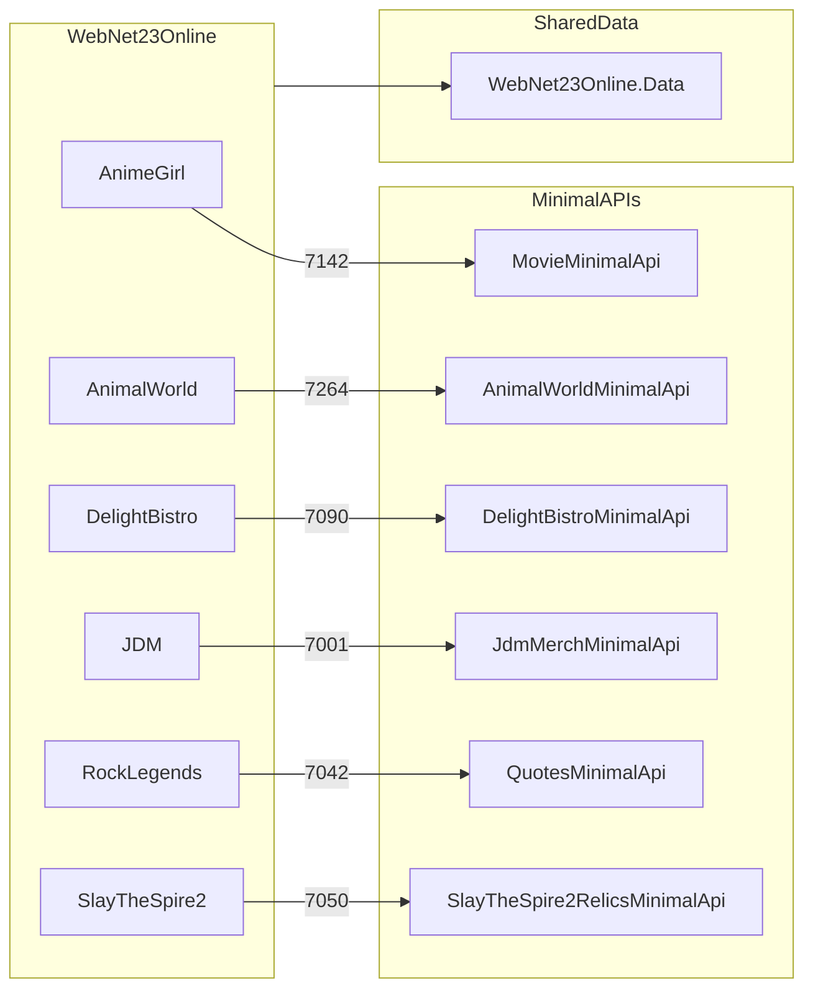

# Карта интеграций Net23Online

Связи между WebNet23Online (MVC), Minimal API и общими библиотеками.

## Архитектурный паттерн

- **WebNet23Online** использует `WebContext` ([WebNet23Online.Data](../WebNet23Online.Data/)) — основная БД сайта.
- **Minimal API** используют **отдельные DbContext и БД** (LocalDB), не `WebContext`.
- Часть модулей MVC вызывает Minimal API из JavaScript (`wwwroot/js/`) по HTTPS.

---

## MVC → Minimal API

| MVC-модуль | JS-файл | API | Порт | Назначение |
|------------|---------|-----|------|------------|
| AnimeGirl | `wwwroot/js/anime-girl/index.js` | MovieMinimalApi | 7142 | Каталог фильмов |
| AnimalWorld | `wwwroot/js/animal-world/animal-species-facts.js` | AnimalWorldMinimalApi | 7264 | Интересные факты о животных |
| DelightBistro | `wwwroot/js/delight-bistro/tea.js` | DelightBistroMinimalApi | 7090 | Каталог чая/напитков |
| JDM | `wwwroot/js/japanese-domestic-market/createJdmMerch.js` | JdmMerchMinimalApi | 7001 | JDM-мерч |
| RockLegendsPortal | `wwwroot/js/rock-legends-portal/quotes.js` | QuotesMinimalApi | 7042 | Цитаты рок-легенд |
| SlayTheSpire2 | `wwwroot/js/SlayTheSpire2/Relics.js` | SlayTheSpire2RelicsMinimalApi | 7050 | Реликвии STS2 |
| LittleLemon | — | LittleLemonMinimalApi | 7100 | **Нет интеграции** (standalone) |

---

## MVC → WebNet23Online.Data

Все бизнес-модули WebNet23Online (кроме данных из Minimal API) работают через `WebContext`:

- AnimalWorld, DelightBistro (меню/еда), LittleLemon, JDM (авто), Steam, HabitTracker и др.

→ [libraries/web-net23-online-data/README.md](libraries/web-net23-online-data/README.md)

---

## Libraries → Projects

| Библиотека | Используют |
|------------|------------|
| MazeCore | WebNet23Online (`MazeController`), FirstConsoleApp |
| WebNet23Online.Data | WebNet23Online |

---

## SignalR (внутри WebNet23Online)

Real-time функции реализованы внутри MVC, не через Minimal API.

→ [web-net23-online/appendix/signalr-hubs.md](web-net23-online/appendix/signalr-hubs.md)

---

## Диаграмма

